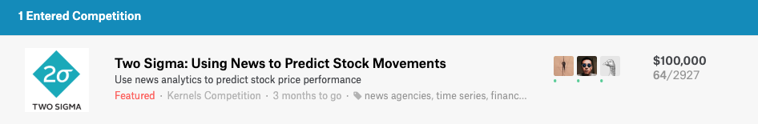

# two_sigma_news_sentiments

### Description

This repository serves as the development for participating in Kaggle Competition [Link](https://www.kaggle.com/c/two-sigma-financial-news). Two Sigma Competition has been one of the most popular competition on Kaggle, with `2927` participating teams, and we rank top `2%` percent with current rank at `64th` place.

### Logistics

+ rule number 1: keep all data file in `.csv` extension otherwise add its type to `.gitignore`
+ rule number 2: we use wiki log for book keeping so each one of us will update daily on wiki
+ rule number 3: make sure to name your `.ipynb` file with your name inside
+ rule number 4: when pushing changes to master, please checkout a branch and push to a remote branch, then create a Pull Request in order to publish your code. DO NOT PUSH DIRECTLY INTO THE MASTER!
+ rule number 5: have fun
